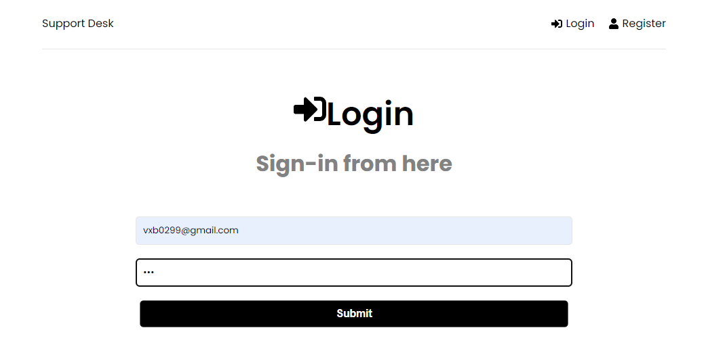

# Ticketing Tool

I've developed this ticketing tool web app with help of react and node js with MongoDB. It's MERN stack web app with sign in/Register and sign out functionality. You can create ticket here and it will be added in MongoDB. 
#### View ticket, edit/close ticket functions are still in progress. Leaving this project in between for some imp work with different project.
 
Please check out below screenshots for better understanding.

## Screenshots

- Home

- New Ticket

- Sign In

- Register

- In-Progress Work

### Technologies used :

 - React
 - HTML/CSS
 - Redux toolkit
 - MongoDB / Compass
 - Node JS
